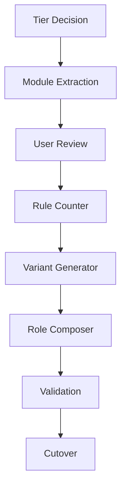

# Opus Review: Module System Design Decisions

**Status**: Decisions provided
**Date**: 2025-12-26
**Reviewer**: claude-opus-4-5-20251101
**Input**: design-review-rule-tiering.md, DESIGN_MODULE_SYSTEM.md

---

## Executive Summary

After reviewing the open questions, I recommend:

1. **Rule tiering**: Hybrid of Options B+D (tier markers in variants, hints in sources)
2. **Module extraction**: Planning phase task, not implementation
3. **Target counts**: Ranges with Opus flexibility (Option D)
4. **Validation**: Warn at thresholds, never auto-regenerate
5. **Granularity**: 13 modules appropriate, validate during extraction
6. **Marker removal**: Simple regex sufficient with validation

---

## CRITICAL Decision 1: Rule Tiering Within Modules

### Decision: Hybrid B+D (Tier Markers + Semantic Hints)

**Mechanism**:

1. Semantic sources contain tier hints via section groupings (human-readable)
2. Opus generates variants with `[RULE:T1]`, `[RULE:T2]`, `[RULE:T3]` markers
3. Role config includes entire modules (no tier filtering at inclusion)
4. Composer distributes rules to sections based on markers

**Why not the pure options?**

| Option | Rejection Reason |
|--------|------------------|
| A (Module-level) | Violates 20/60/20 distribution requirement |
| B (Pure markers) | Requires rigid tier markers in semantic sources |
| C (Section-based) | 13 modules × 3 sections = excessive structural overhead |
| D (Pure hints) | Insufficient determinism for budget validation |

**Hybrid approach**:

```markdown
# modules/src/communication.semantic.md
---
author_model: claude-opus-4-5-20251101
expansion_sensitivity: explicit
target_rules:
  strong: 4-6
  weak: 12-16
---

## Critical (Tier 1)
Agent must stop on unexpected results. Describe expected vs observed, then STOP.
Agent must wait for explicit instruction before proceeding with plans.

## Important (Tier 2)
Request validation every 3 test-implement cycles.
Ask clarifying questions if requirements unclear.

## Preferred (Tier 3)
Complete assigned task then stop (no scope creep).
```

**Generated weak variant**:

```markdown
# communication.weak.md

[RULE:T1] ⚠️ STOP immediately if results are unexpected (fail OR succeed)
[RULE:T1] Describe expected vs observed when stopping
[RULE:T1] ⚠️ WAIT for explicit instruction before proceeding
[RULE:T1] DO NOT assume "continue" is implied

[RULE:T2] Request validation every 3 test-implement cycles
[RULE:T2] Stop and ask: "Completed 3 cycles - ready for next?"
[RULE:T2] Ask clarifying questions if requirements are unclear
[RULE:T2] Be explicit about assumptions

[RULE:T3] Complete assigned task then stop
[RULE:T3] No scope creep beyond task boundaries
[RULE:T3] If you see improvement opportunities, note them but don't act
```

**Role composition**:

```python
def compose_role(config, variants):
    sections = {
        'CRITICAL_RULES': [],
        'GUIDELINES': [],
        'PREFERENCES': []
    }

    tier_map = {'T1': 'CRITICAL_RULES', 'T2': 'GUIDELINES', 'T3': 'PREFERENCES'}

    for module in config.modules:
        variant = variants[module][config.target_class]
        for rule in extract_rules(variant):
            tier = rule.tier_marker  # T1, T2, or T3
            sections[tier_map[tier]].append(rule.text)

    return render_role(config, sections)
```

**Key clarifications**:

1. **Tier assignment does NOT change between variants**. Tier represents semantic criticality. A tier 1 rule stays tier 1 whether strong or weak variant.

2. **What changes between variants**:
   - Number of rules (expansion may split one concept into multiple rules)
   - Wording (explicit for weak, concise for strong)
   - Formatting (⚠️ markers for weak models)

3. **Role config semantics**:
   ```yaml
   modules:
     cross_cutting:
       - communication  # Include ALL tiers from this module
   ```
   No tier filtering at inclusion. The module's internal tier markers determine placement.

**Trade-off accepted**: Opus must assign tier markers during generation. This is an LLM judgment task. Validation can check tier distribution (warn if >40% tier1).

---

## CRITICAL Decision 2: Module Extraction Process

### Decision: Planning Phase Task

Module extraction is **planning work**, not implementation. It requires:

- Pattern recognition across 6 role files
- Semantic grouping decisions
- Tier hint assignment
- Cross-cutting concern identification

**Process**:

```
Phase 1: Module Extraction (Opus, planning role)
├── Load current role files
├── Identify duplication patterns
├── Extract to semantic sources with tier hints
├── Assign expansion_sensitivity
└── Deliverable: Complete modules/src/*.semantic.md inventory

Phase 2: User Review
├── Validate module boundaries
├── Confirm tier assignments
├── Adjust granularity if needed
└── Approve for implementation

Phase 3: Implementation (Script development)
├── Build rule counter
├── Build variant generator
├── Build role composer
└── Build validation pipeline
```

**Why planning, not implementation?**

| Activity | Category | Rationale |
|----------|----------|-----------|
| Identify cross-cutting concerns | Planning | Requires semantic understanding |
| Decide module boundaries | Planning | Judgment about cohesion |
| Assign tier hints | Planning | Priority reasoning |
| Write Python scripts | Implementation | Mechanical translation |
| Create Makefile | Implementation | Build system knowledge |

**Output format for extraction**:

```
modules/
└── src/
    ├── communication.semantic.md
    ├── tool-batching.semantic.md
    ├── checkpoint-obedience.semantic.md
    ├── context-overview.semantic.md
    ├── context-datamodel.semantic.md
    ├── context-commands.semantic.md
    ├── tdd-cycle.semantic.md
    ├── plan-creation.semantic.md
    ├── plan-adherence.semantic.md
    ├── code-quality.semantic.md
    ├── memory-management.semantic.md
    ├── commit.semantic.md
    └── handoff.semantic.md
```

**Extraction should happen AFTER tier design decision** (this document provides that).

---

## CRITICAL Decision 3: Target Rule Count Determination

### Decision: Option D (Target Ranges) with Opus Flexibility

**Mechanism**:

```yaml
# Semantic source frontmatter
---
target_rules:
  strong: 3-5
  standard: 8-12
  weak: 12-18
---
```

**Budget planning**:
- Use max of range for budget estimation
- Sum across modules for role budget check
- Opus generates within range
- Exceeding range generates warning, not failure

**Why not other options?**

| Option | Issue |
|--------|-------|
| A (Ratios) | Too rigid; Opus can't adjust for semantic complexity |
| B (Explicit) | Manual math; harder to adjust globally |
| C (Opus decides) | Unpredictable; can't plan budgets |

**Ranges provide**:
- Budget predictability (sum max values)
- Opus flexibility within bounds
- Clear validation thresholds
- Adjustment mechanism (widen range if needed)

**Expansion sensitivity as guidance, not calculation**:

```yaml
# Instead of computing from sensitivity:
expansion_sensitivity: high  # 1x:3x:5x → weak = 15 rules

# Provide explicit ranges (sensitivity informs author's choice):
target_rules:
  strong: 3-5    # Author chose based on "high" sensitivity
  weak: 12-20    # 4x-6.7x expansion range
```

**Opus generation prompt**:
```
Generate weak variant for communication module.
Target: 12-18 rules total.
Mark each rule with [RULE:T1], [RULE:T2], or [RULE:T3].
Preserve tier distribution from semantic source (~20% T1, ~60% T2, ~20% T3).
```

---

## Decision 4: Validation Warnings

### Thresholds

| Scenario | Threshold | Warning Message |
|----------|-----------|-----------------|
| Module exceeds target range | >max | "communication.weak.md: 19 rules (target: 12-18)" |
| Role exceeds budget | >budget | "planning.md: 48 rules (budget: 45, +3 over)" |
| Global budget exceeded | >150 | "Total: 155 rules (limit: 150, +5 over)" |
| Tier distribution skewed | >30% deviation | "planning.md: tier1=38% (expected: ~20%)" |

### Tier Distribution Validation

**Expected distribution**: 20/60/20 (T1/T2/T3)
**Acceptable range**: ±10 percentage points

```python
def validate_tier_distribution(rules):
    counts = Counter(r.tier for r in rules)
    total = len(rules)

    t1_pct = counts['T1'] / total * 100
    t2_pct = counts['T2'] / total * 100
    t3_pct = counts['T3'] / total * 100

    warnings = []
    if t1_pct > 30:
        warnings.append(f"Tier1 heavy: {t1_pct:.0f}% (expected ~20%)")
    if t2_pct < 40:
        warnings.append(f"Tier2 light: {t2_pct:.0f}% (expected ~60%)")

    return warnings
```

### Action on Warnings

1. **Log warning** with specific numbers
2. **Continue pipeline** (don't halt)
3. **Generate summary** at end of composition
4. **Human review queue** for decisions

**Never auto-regenerate**. Risk of infinite loops. Human decides: accept, adjust targets, or manually edit.

---

## Decision 5: Module Granularity

### Validation: 13 Modules Appropriate

**Analysis**:

| Module | Estimated Weak Rules | Assessment |
|--------|---------------------|------------|
| communication | 12-16 | Appropriate |
| tool-batching | 8-12 | Appropriate |
| checkpoint-obedience | 10-15 | Appropriate |
| context-overview | 6-10 | Appropriate |
| context-datamodel | 8-12 | Appropriate |
| context-commands | 5-8 | Appropriate |
| tdd-cycle | 15-20 | Appropriate |
| plan-creation | 12-16 | Appropriate |
| plan-adherence | 10-14 | Appropriate |
| code-quality | 10-14 | Appropriate |
| memory-management | 8-12 | Appropriate |
| commit | 8-12 | Appropriate |
| handoff | 6-10 | Appropriate |

**Total estimated**: 118-171 rules (weak variants)

**Granularity guidelines**:

```python
def validate_granularity(modules):
    for module in modules:
        weak_count = module.target_rules.weak.max

        if weak_count > 25:
            suggest(f"Consider splitting {module.name}: {weak_count} rules")
        if weak_count < 5:
            suggest(f"Consider merging {module.name}: only {weak_count} rules")
```

**No splits/merges needed** for current inventory. Validate during extraction phase.

---

## Decision 6: Marker Removal

### Simple Regex Sufficient

```python
import re

def remove_markers(content: str) -> str:
    """Remove [RULE] and [RULE:Tn] markers from composed role."""
    result = re.sub(r'\[RULE(?::T\d)?\]\s*', '', content)

    # Validation: no markers should remain
    if '[RULE' in result:
        raise ValueError("Marker removal incomplete")

    return result
```

**Edge cases handled**:

| Input | Output |
|-------|--------|
| `[RULE] Text` | `Text` |
| `- [RULE] Text` | `- Text` |
| `[RULE:T1] Text` | `Text` |
| `⚠️ [RULE:T1] Text` | `⚠️ Text` |

**Multiple markers per line**: Unlikely by design. Regex handles regardless (global replace).

---

## Implementation Order

### Recommended Sequence

```
Week 1: Foundation
├── Day 1-2: Module extraction (planning role, Opus)
│   └── Deliverable: modules/src/*.semantic.md
├── Day 3: User review of extracted modules
└── Day 4-5: Rule counter script
    └── Deliverable: count-rules.py

Week 2: Generation Pipeline
├── Day 1-2: Variant generator (Opus prompt + runner)
│   └── Deliverable: generate-variant.py
├── Day 3: Generate weak variants for all modules
│   └── Deliverable: modules/gen/*.weak.md
└── Day 4-5: Validation testing
    └── Deliverable: Validated module inventory

Week 3: Composition
├── Day 1-2: Role composer script
│   └── Deliverable: compose-role.py
├── Day 3: Compose all role files
│   └── Deliverable: roles/gen/*.md
├── Day 4: Side-by-side testing (old vs new)
└── Day 5: Cutover + archive old files
```

### Dependencies



---

## Missing Considerations

### 1. Version Compatibility

When Opus model ID changes, all variants regenerate. But semantic sources are static. Need migration strategy:

```yaml
# Track in semantic source
---
last_generated:
  model_id: claude-opus-4-5-20251101
  date: 2025-12-26
---
```

### 2. Partial Regeneration

If one module changes, only regenerate that module's variants. Don't regenerate all 13 modules.

### 3. Tier Override in Role Config

Edge case: Role needs a module's T2 rule treated as T1. Support explicit overrides:

```yaml
modules:
  - communication:
      tier_overrides:
        "wait for instruction": T1  # Promote to tier1 for this role
```

**Recommendation**: Defer to v2. Keep v1 simple.

### 4. Skill Module Treatment

Skills (commit, handoff) are on-demand loaded at session boundaries.

**Decision: No variants for skills. Weak wording only.**

Rationale:
- Skills loaded at session end when context pressure is lowest
- Weak wording works universally (no correctness issue for strong models)
- Marginal token savings (~50 lines × 2 files) doesn't justify pipeline complexity
- Avoids maintaining 6 additional generated files (2 skills × 3 variants)

Skills should:
- Use tier markers for internal structure (primacy/recency within skill)
- Not count against role budget (loaded separately)
- Remain as single weak-optimized files (no generation pipeline)

---

## Risk Assessment

| Risk | Likelihood | Impact | Mitigation |
|------|------------|--------|------------|
| Opus tier assignment inconsistent | Medium | High | Validation + human review |
| Budget exceeded after composition | Medium | Medium | Warn + manual adjustment |
| Semantic source drift from variants | Low | Medium | Regeneration on source change |
| Weak variant under-expanded | Medium | High | Target ranges allow flexibility |

---

## Summary of Decisions

| Question | Decision | Confidence |
|----------|----------|------------|
| Rule tiering | Hybrid B+D (markers + hints) | High |
| Module extraction | Planning phase task | High |
| Target counts | Ranges (Option D) | High |
| Validation warnings | Thresholds per scenario | Medium |
| Module granularity | 13 modules appropriate | High |
| Marker removal | Simple regex + validation | High |

---

**END OF REVIEW**
